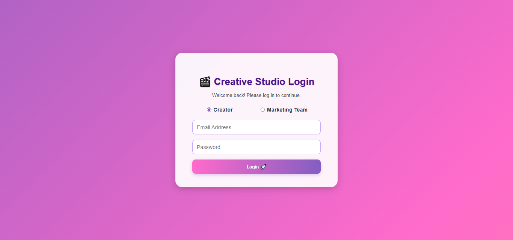
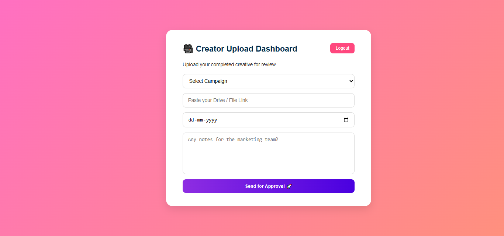
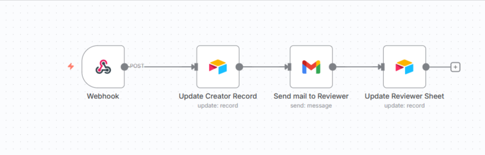
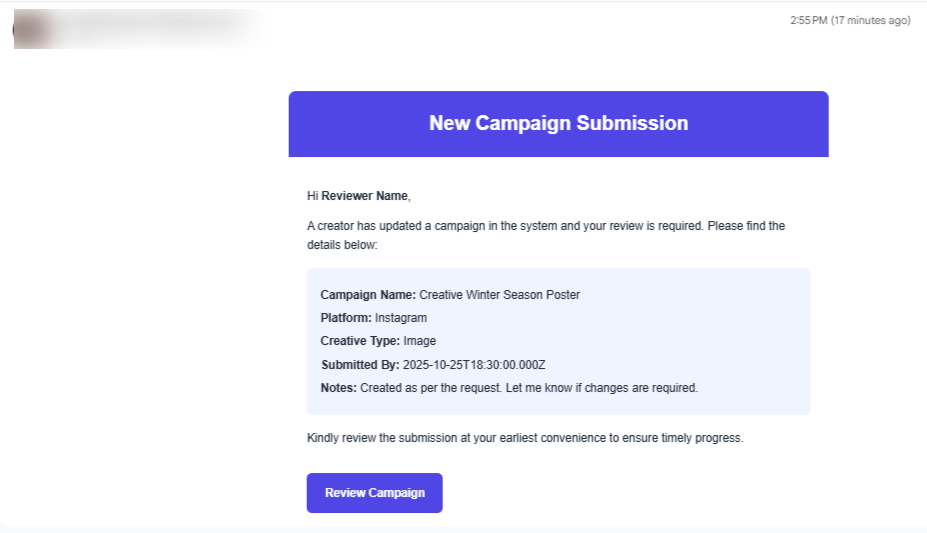
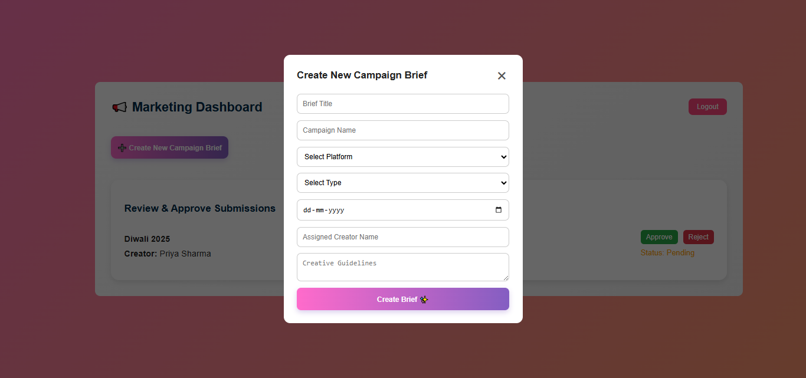
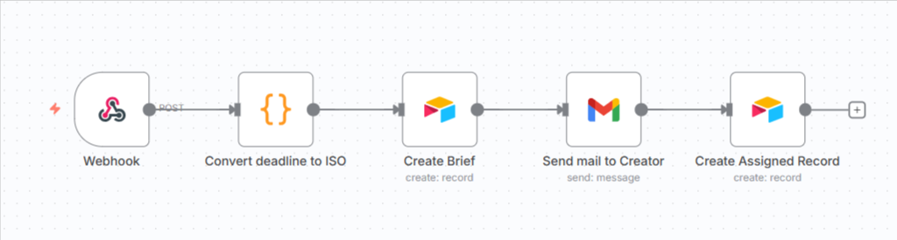
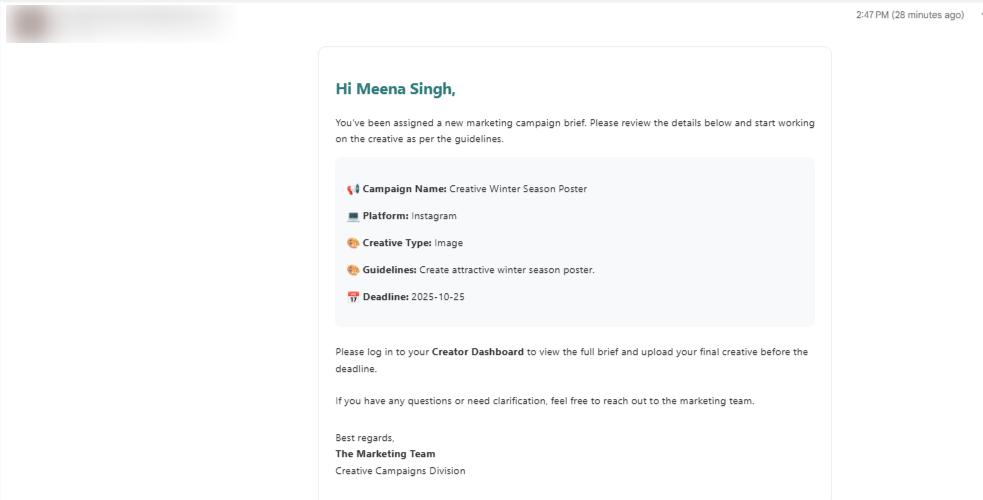

## 🎨 Creative Production Tracker

## Overview

The Creative Production Tracker is a full-stack workflow automation system built for creative teams to manage campaigns, briefs, and review cycles efficiently.
It provides role-based dashboards — Creator, Reviewer, and Marketing — with automation for submissions, AI-assisted insights, and real-time Airtable integration.

## 🚀 Key Features

✅ 🔐 Role-Based Login System
    Creators: Submit campaign creatives (images, videos, or scripts).
    Marketing Team: Create and assign creative briefs for the creator team.
    Reviewers: Receive submissions automatically via email and approve or reject directly.

✅ 📊 Dynamic Dashboards
    Personalized dashboards for each role.

✅ 📧 Automated Notifications
    When creators submit a project, an automated email is sent to reviewers.
    Status changes trigger real-time updates and follow-up emails.

✅ 🗃️ Airtable Integration
    Stores all project data: campaign name, brief, creator, status, review notes, and timestamps.
    Updates automatically when any user submits or edits data.

## 🧠 Workflow, UI and Email Flow

1. Login Page Design 
   
   

2. Creator Dashboard where creator submits creatives.

   

3. Creator Submits Creative Workflow 
   
   

4. Sends mail to reviewer / Marketing Team for review
   
   

5. Create Breif By Marketing Team UI Design
   
   

6. Create Brief Workflow 
   
   

7. Send Notification to Creator
   
   

## 🧑‍💻 Author

👩‍💻 Meghna Ghatak 
Role: UI Developer & Automation Workflow Specialist
Expertise: React.js • n8n • Power Automate • OpenAI API • Airtable
Focus: Building smart, automated workflows for creative production teams.